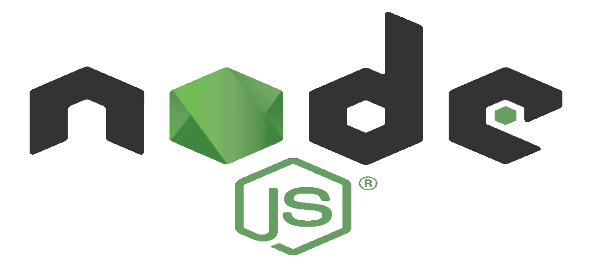

# Rocketseat's Ignite Bootcamp

This repository groups the projects developed in Rocketseat's Node.js Ignite Bootcamp.

# Node.js

Build simple scalable architectures for web using a flexible and popular language.

## Chapter I

### Fundamentals of Node.js

In these modules we'll know concepts of Node.js, how it works, and the reasons
why it was created.
We will study the concepts and rules behind an REST API, HTTP Methods, return codes, and parameters of an requisition.

### First Project with Node.js

In this module we will build our first project, putting in practice all first
module concepts.

### Challenge: Concepts of Node.js

In this challenge you need to build an application to train what you learned
until then.

[Repository](https://github.com/Vyctor/ignite-conceitos-nodejs)

### Challenge: Working with Middlewares

In this challenge we will work deeper along middlewares with Express.
Thus, you'll be capable to estabilish further the knowledge gained so far.

[Repository](https://github.com/Vyctor/ignite-trabalhando-com-middlewares)

### Challenge: Fixing the Code

In this challenge we have a Node.js application in development process, wich already have all necessary tests to make the requeriments validation.

[Repository](https://github.com/Vyctor/ignite-corrigindo-o-codigo)

## Chapter II

### Starting the API

Learn to develop applications using Typescript, following code patterns and SOLID Principles.
The most important concepts and use-cases, repositories, models, Node.js stream and documentation with swagger.

[Repository](https://github.com/Vyctor/rentx-api)

#### Challenge SOLID Introduction

In this challenge we built an API following the clean architecture structure learned until now.

[Repository](https://github.com/Vyctor/nodejs-desafio-introducao-solid)

#### Challenge Using Swagger

In this challenge i have documented with Swagger the API developed in previous challenge.
[Repository](https://github.com/Vyctor/nodejs-desafio-introducao-solid)

## Chapter III

### Continuing the API

We start our main app, RentX, creating the base app, with authentication, sign-up, avatar upload, etc, using a relational database and knowing concepts and tools like Docker, TypeORM, TSyringe, JWT and bcrypt.

[Repository](https://github.com/Vyctor/rentx-api)

### Challenge - Database Queries

In this challenge you will train the three types of queries with TypeORM:

- using ORM,
- using QueryBuilder
- using Raw Query

[Repository](https://github.com/Vyctor/rentx-api)

### Challenge - Database modeling

In this challenge you will practice some database modeling, using the latest challenge application developed.

[Repository](https://github.com/Vyctor/rentx-api)

## Chapter IV

### Tests and business rules

In this chapter we're build part of funcionalities and business rules of our application using automatized tests with Jest and Supertest, developing the complete documentantion of fucionalities with Swagger.

[Repository](https://github.com/Vyctor/rentx-api)

### Challenge - Unit tests

In this challenge we built unit tests of an API using all that you learn from now.

[Repository](https://github.com/Vyctor/desafio-testes-unitarios)

### Challenge - Integration tests

In this challenge we built integration tests of to add more test coverage on FinAPI.

[Repository](https://github.com/Vyctor/desafio-testes-unitarios)
